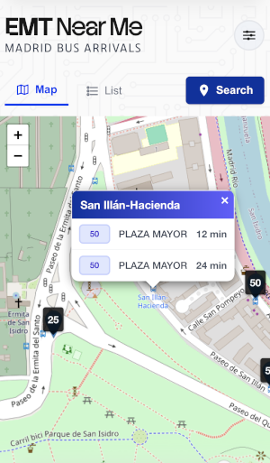

## EMT Near Me



A **Next.js** app that shows **real-time Madrid bus arrivals** using the **EMT Madrid open data API**. Quickly find nearby bus stops and view arrival times for EMT buses.

## Technologies Used

- [Next.js](https://nextjs.org) – React framework for server-side rendering and static sites.  
- [EMT Madrid Mobility Labs API](https://mobilitylabs.emtmadrid.es/) – Real-time bus data.  
- [Leaflet](https://leafletjs.com/) – Interactive maps.  


## Getting Started

```bash
npm install
```

1. Go to https://mobilitylabs.emtmadrid.es/
2. Register for a free account
3. Add username and password to .ENV file

```bash
npm run dev
```
